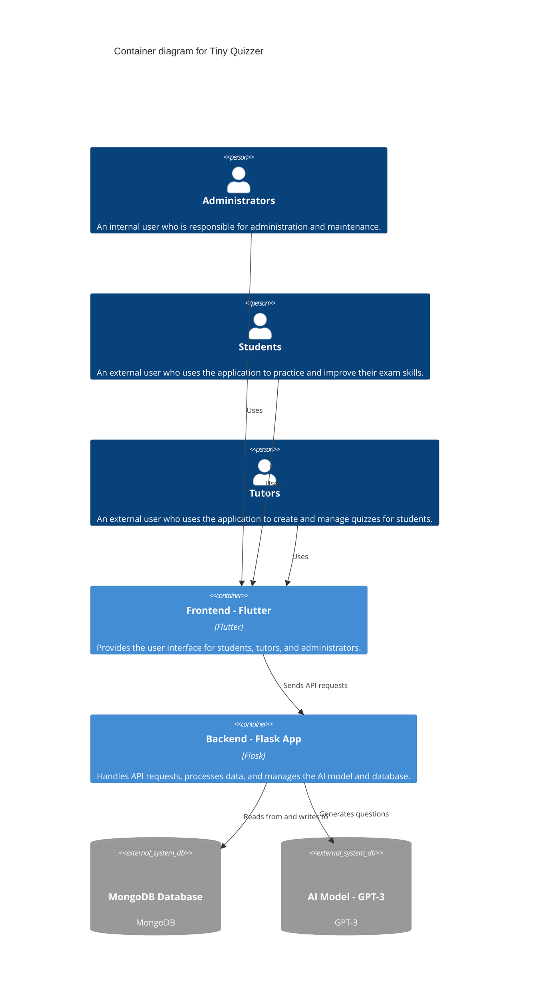

# Architecture Documentation

## Overview

Tiny Quizzer's architecture consists of a frontend built using Flutter for cross-platform mobile app compatibility and a backend implemented in Python using the Flask web framework. The backend serves as a RESTful API, which the frontend communicates with to request and receive data.

```mermaid
graph TB
  subgraph Runtime [Deployed on Cloud Services]
    A[Frontend - Flutter] --> W
    C[AI Model - GPT-3]
    D[MongoDB Database]
  end
  subgraph W[Web Server]
    N[Ngnix - Reverse Proxy] --> B[Backend - Flask App]
    B --> C
    B --> D
  end
  subgraph Tiny Quizzer
    G[Continuous Integration & Deployment - GitLab CI/CD] --> Runtime
  end

  ```

## Frontend

### Flutter

-   The frontend is built using the Flutter framework, which enables cross-platform app development for Android and iOS.
-   The Dart programming language is used to develop the UI and handle user interactions.
-   The `http` package is used for making API calls to the backend.

## Backend

### Flask

-   The backend is implemented in Python using the Flask web framework.
-   The Flask app exposes RESTful API endpoints for the frontend to interact with.
-   The backend handles user authentication, data storage, and AI-powered question generation.

### AI Question Generation

-   The OpenAI GPT-3 model is utilized to generate questions based on user preferences and performance.
-   The model is fine-tuned for generating questions specific to the 11+ exams and other related tests.

### Data Storage

-   A PostgreSQL database is used to store user data, including profiles, quiz history, and performance analytics.
-   SQLAlchemy, an Object Relational Mapper (ORM), is used to interact with the database from the Flask app.

## Deployment and Infrastructure

### Web Server

-   The Flask app is deployed on a web server using Gunicorn, a WSGI HTTP server for Python applications.
-   Nginx is used as a reverse proxy to handle incoming requests and route them to the appropriate Gunicorn worker processes.

### Cloud Services

-   The application is hosted on a cloud provider such as Heroku, AWS, or DigitalOcean for scalability and reliability.
-   Cloud-based storage (e.g., AWS S3) is used to store static files, such as images and documents.

### Continuous Integration and Deployment

-   GitLab CI/CD is used to automate the testing and deployment process.
-   The pipeline includes steps for building the Flutter app, running backend tests, and deploying the application to the cloud provider.

## Technical Architecture

### System Context

The System Context in the C4 model is the highest level of abstraction, providing a high-level view of the system and its interaction with external entities. Here's the System Context diagram for Tiny Quizzer using Mermaid:

```mermaid
C4Context
  title System Context diagram for Tiny Quizzer

    Person(administrator, "Administrators", "An internal user who is responsible for administration and maintenance.")
    Person_Ext(student, "Students", "An external user who uses the application to practice and improve their exam skills.")
    Person_Ext(tutor, "Tutors", "An external user who uses the application to create and manage quizzes for students.")

  System_Boundary(b1, "Tiny Quizzer System") {
    Container(frontend, "Frontend - Flutter", "Flutter", "Provides the user interface for students, tutors, and administrators.")
    Container(backend, "Backend - Flask App", "Flask", "Handles API requests, processes data, and manages the AI model and database.")
  }

  System_Boundary(boundary_id, "External Services", "asdasd") {
    SystemDb_Ext(database, "MongoDB Database", "MongoDB", "Stores quiz data and user information.")
    SystemDb_Ext(ai_model, "AI Model - GPT-3", "GPT-3", "Generates questions for quizzes.")  
  }
  
  

  Rel_D(administrator, frontend, "Uses")
  Rel_D(student, frontend, "Uses")
  Rel_D(tutor, frontend, "Uses")

  Rel_D(frontend, backend, "Sends API requests")
  Rel_D(backend, database, "Reads from and writes to")
  Rel_D(backend, ai_model, "Generates questions")

```

In this System Context diagram, the Tiny Quizzer System subgraph contains the main components of the application, including the Frontend (Flutter), Backend (Flask App), AI Model (GPT-3), Web Server, and MongoDB Database. The External Entities subgraph represents the interactions between the Tiny Quizzer System and external systems or users, such as Cloud Services, CI/CD pipeline (GitLab CI/CD), and the various user roles (Students, Tutors, and Administrators).

This diagram provides a high-level view of the Tiny Quizzer system, its components, and its interactions with external entities, helping stakeholders understand the overall context of the solution.

### Container

The Container section of the C4 model provides a more detailed view of the system, showcasing the individual containers that make up the Tiny Quizzer application. Here's the PlantUML C4Container code and an explanation of the containers:



In this Container diagram, we have the following containers for the Tiny Quizzer application:

1. **Frontend - Flutter**: This container is responsible for providing the user interface for students, tutors, and administrators. It is built using Flutter, allowing the application to run on multiple platforms, such as web and mobile.

2. **Backend - Flask App**: This container handles API requests from the frontend, processes data, and manages the AI model and the database. It is built using the Flask framework in Python, which provides flexibility and scalability.

3. **MongoDB Database (External Service)**: This container represents the external MongoDB Database, which stores quiz data and user information. It is an external service that is not part of the Tiny Quizzer application, but it is used by the backend to store and retrieve data.

4. **AI Model - GPT-3 (External Service)**: This container represents the external AI Model, which generates questions for quizzes using GPT-3. It is an external service that is not part of the Tiny Quizzer application but is used by the backend to generate questions.
